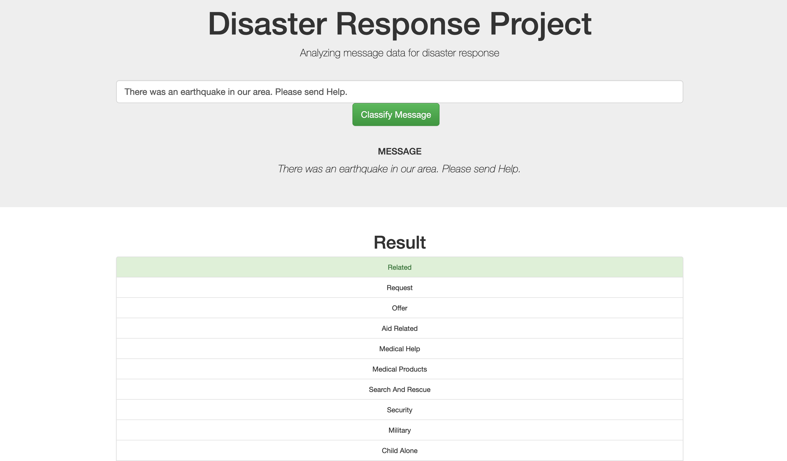
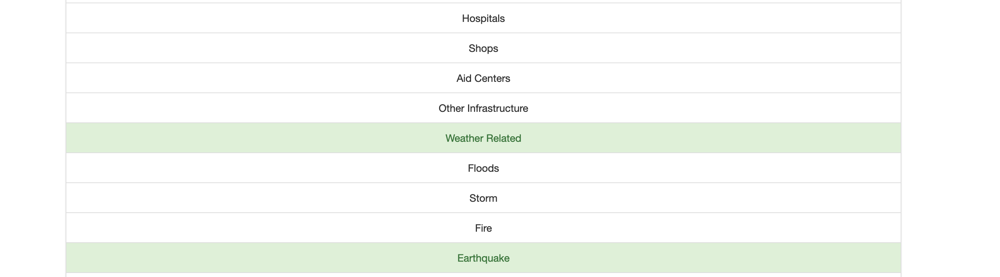
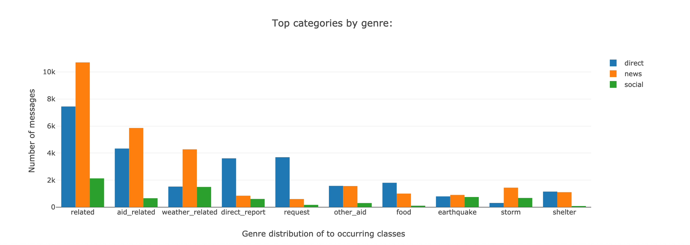
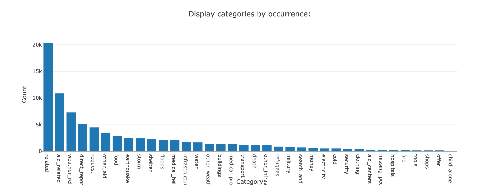
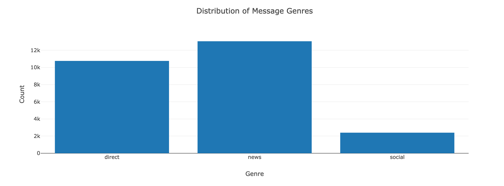

# Disaster Response Pipeline Project
A Web App project that classifies disaster related text messages into several categories.

The project was created along a coding exercise on the Udacity Nano degree. 


### Table of Contents

1. [Installation](#installation)
2. [Project Motivation](#motivation)
3. [File Descriptions](#files)
4. [Results](#results)


## Installation <a name="installation"></a>

You need to have a Python 3.x environment. I used anaconda. This project uses some packages, which you might need to install using the statement "pip install my_package" in your conda console.

The following libraries need to be installed:
- sikit-learn
- nltk
- numpy
- pandas
- plotly
- sqlalchemy
- flask


## Project Motivation<a name="motivation"></a>

The dataset at hand is provided by Figure Eight for a Udacity project task. 
The  goal  is to clean up the raw data, develop and optimize a full machine learning pipeline for text classification.
The classified model should be used in a web app for on-demand text message classification.


Dashboard:


On demand text message classification


## File Descriptions <a name="files"></a>

* data/process_data.py This script provides the ETL task. Extracting the training data from the CSV Files, make reasonable transforamtions and load it into a database.
* models/train_classifier.py This script performes the classification task on the traning data and provides a model, that is stored as a .pkl file for later use.
* app/run.py The run script uses the generates a web-page that provides an interface for the user to use the trained model in order to classify new text data. Additionally it provides some descriptive statistics on the data. (see picture below)






## Instructions <a name="instructions"></a>
```sh
  1. Run the following commands in the project's root directory to set up your database and model.

      - To run ETL pipeline that cleans data and stores in database
          `python data/process_data.py data/disaster_messages.csv data/disaster_categories.csv data/DisasterResponse.db`
      - To run ML pipeline that trains classifier and saves
          `python models/train_classifier.py data/DisasterResponse.db models/classifier.pkl`

  2. Run the following command in the app's directory to run your web app.
      `python run.py`

  3. Go to http://0.0.0.0:3001/
```

## Results<a name="results"></a>
The projects shows the whole data science process.
The emphasis of this work lies on  providing an end to end ML process instead of getting the best model performance. 

